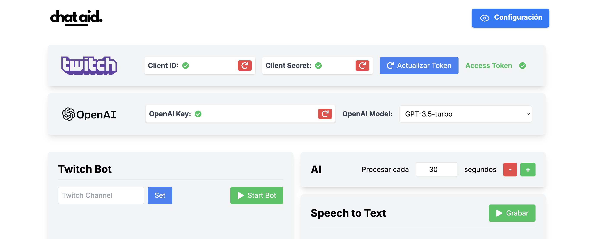

# Chat Aid

Chat Aid es una aplicación web diseñada para ayudarte a interactuar con tus espectadores de Twitch de manera eficiente, utilizando inteligencia artificial y transcripción de voz en tiempo real. La aplicación está especialmente enfocada en responder preguntas del chat que el streamer no ha podido ver en tiempo real o que ya han sido respondidas anteriormente, mejorando la experiencia tanto para el streamer como para los espectadores.



## Características

- **Interacción Mejorada con los Espectadores**: Ayuda a responder preguntas del chat que el streamer puede haber pasado por alto o que ya han sido respondidas anteriormente.
- **Reconocimiento de Voz**: Transcribe en tiempo real el audio del streamer para usarlo en las respuestas automáticas.
- **Utiliza Vercel AI SDK y OpenAI**: Genera respuestas a las preguntas del chat basándose en la transcripción del audio del streamer.

## Tecnologías Utilizadas

- **Next.js**
- **React**
- **TypeScript**
- **Tailwind CSS**
- **Zustand**
- **Vercel SDK AI**
- **OpenAI API**
- **TMI.js**

## Requisitos Previos

1. Crea una aplicación de Twitch en [Twitch Developers](https://dev.twitch.tv/console/apps) para obtener el Client ID y Client Secret.
2. Obtén una clave de API de OpenAI en [OpenAI](https://www.openai.com/).

## Instalación

1. Clona este repositorio en tu máquina local:

   ```bash
   git clone https://github.com/xavirn89/chat-aid.git
   cd chat-aid
   ```

2. Instala las dependencias:

   ```bash
   npm install

   # o

   yarn install
   ```

3. Crea un archivo .env.local en la raíz del proyecto y añade la url de redireccionamiento
   ```bash
   NEXT_PUBLIC_TWITCH_REDIRECT_URI=http://localhost:3000/api/twitch/oauth
   ```

## Uso

1. Si estas en local, inicia el servidor de desarrollo:

   ```bash
   npm run dev
   ```

   y luego ve a `http://localhost:3000`

2. Si usas la aplicación desplegada ve a `https://chat-aid.vercel.app/`

3. Introduce el Twitch Client ID y el Twitch Client Secret de la Twitch App que has creado en Twitch Developers.

4. Pulsa el botón de Obtener Access Token, esto te redirigirá a Twitch donde tendrás que dar autorización a la Twitch App que has creado en Twitch Developers para que pueda funcionar en tu cuenta de Twitch.

5. Una vez obtenidos los Access Token, te redirigirá de nuevo a nuestra página, donde debes introducir la OpenAI Key y seleccionar el modelo que deseas usar.

6. Te aparecerá un panel de control donde debes introducir el canal de Twitch al que quieres que el bot entre.

7. Decide cada cuántos segundos quieres que el bot procese tu transcripción de voz y los mensajes del chat.

8. Enciende el Speech To Text, da autorización para usar el micrófono y activa el bot.

## Estructura del Proyecto

- `components/`: Componentes reutilizables de la aplicación.
- `sections/`: Secciones específicas de la aplicación (por ejemplo, header, footer, nav, etc).
- `stores/`: Almacenamiento de estado usando Zustand.
- `utils/`: Utilidades y funciones auxiliares.
- `app/`: Estructura de la app.

## Gestión de Claves

Las claves y tokens de OpenAI y Twitch se almacenan en cookies para mantener la seguridad y privacidad del usuario. No se almacena ninguna clave en bases de datos.

## Contacto

Autor: Xavi Ramon Nicolau  
LinkedIn: [Xavi Ramon Nicolau](https://www.linkedin.com/in/xavi-ramon-nicolau-08289a261/)  
GitHub: [xavirn89](https://github.com/xavirn89)
